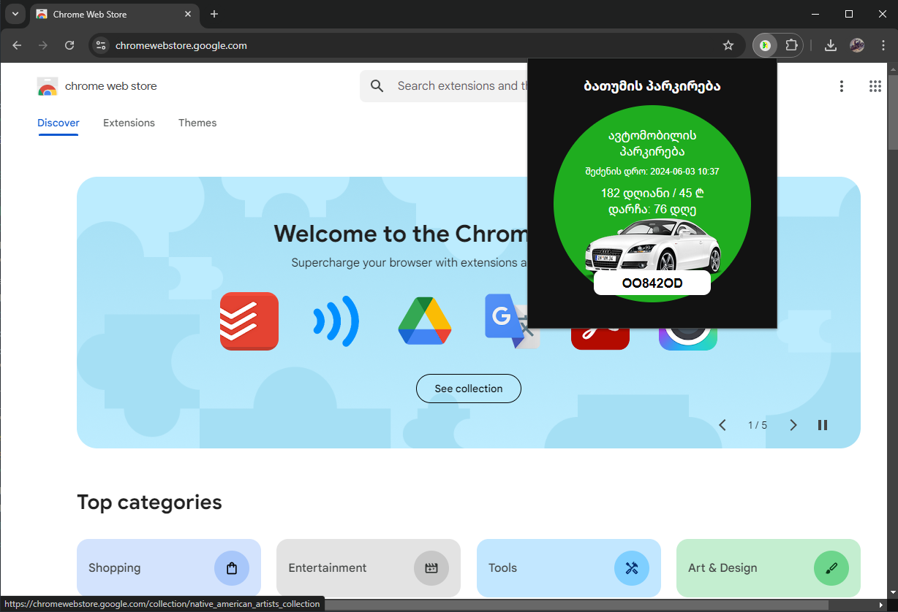

## ბათუმის პარკირების გადახდების Chrome Extension
Just for fun ❤ ...

უბრალოდ აჩვენებს პარკირების გადახდას ავტომობილის სახელმწიფო ნომრის მიხედვით.
დაინსტალირების შემდეგ უნდა შეხვიდეთ ექსტენშენის "Option" ფანჯარაში, შეიყვანოთ ნომერი და დააწვეთ შენასხვას,

### როგორ დავაყენოთ ლოკალურად
1. გადმოწერეთ ფაელები
2. შედით გვერდზე chrome://extensions/
3. გადართეთ Developer mode
4. დაქლიქეთ Load unpacked და მიუთითეთ ფოლდერი

##
Screenshot:

